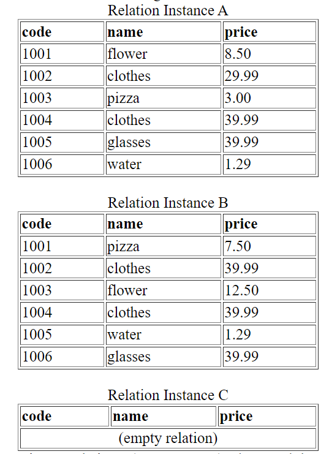
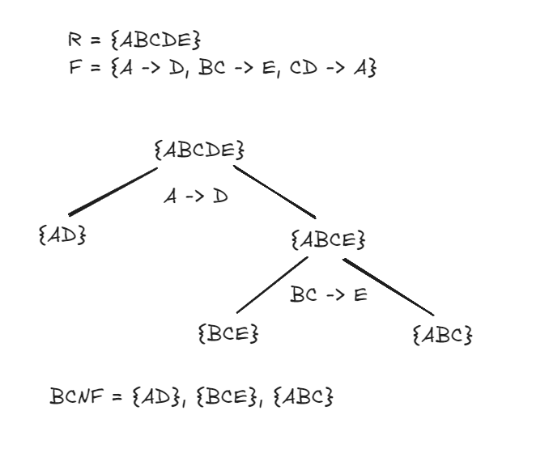
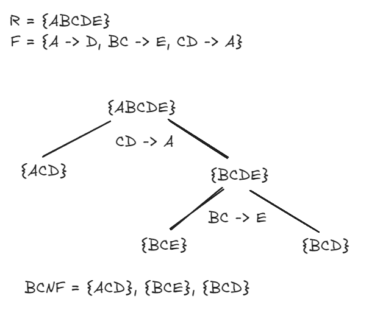

# Assignment 9
**Question instructions are in bold.**
## Question 1
1. **Which of the following relation instances satisfies the functional dependency (name → price)? Briefly justify your answer.**  
	- 

B and C satisfy this functional dependency.

A does not satisfy this dependency as two tuples have the equivalent name 'clothes', but have different price values (29.99 and 39.99).

B satisfies this dependency as even when two tuples have an equivalent name, their prices are the same ('clothes' tuples both have price 39.99).

C satisfies this dependency as it is vacuously true. We can't prove this dependency doesn't hold as there are no two tuples with the same name and different prices in the relation.

## Question 2
**Given a relation R(A, B, C, D, E) where each letter in the brackets represents an attribute of relation R, and a set of functional dependencies that should hold on relation R:**
- **F = {A → D, BC → E, CD → A}.**
    
### Question 2a
**List all the candidate keys of R.**

A good way to construct these candidate keys is to recognize that the only way to determine E is through BC (or E itself). This way, we can use BC -> E as the base for constructing candidate keys.

Using BC -> E only leaves A and D, adding either A or D solves this issue (but adding both makes a superkey not a candidate key), as A -> D and CD -> A.

The candidate keys of R are: ABC, BCD

### Question 2b
**R is not in Boyce-Codd normal form (BCNF). Why?**

For R to be in BCNF:
- FOR EVERY X -> Y in F:
	1. (X → Y) is trivial (i.e., Y ⊆ X), or 
	2. X is a superkey of R

Immediately, we can see with FD A -> D that R is not in BCNF, as A -> D is not trivial and A is not a superkey of R.
- This is also true for BC -> E and CD -> A, as BC and CD are not superkeys of R.

### Question 2c
**Find a lossless join decomposition to decompose R into a collection of relations such that each decomposed relation is in BCNF.**
 
Decomposition 1: {AD}, {BCE}, {ABC}



Decomposition 2: {ACD}, {BCE}, {BCD}



### Question 2d
**Is R in Third normal form (3NF)? Briefly justify your answer.**

For R to be in 3NF:
- FOR EVERY X -> Y in F:
	1. (X → Y) is trivial (i.e., Y ⊆ X), or 
	2. X is a superkey of R, or
	3. each attribute of Y is contained in a candidate key of R

From question 2b, we already know that none of the FDs in F meet condition 1 or 2.
For condition 3, we can see from the dependency BC -> E that R is not in 3NF, as E is not contained in a candidate key of R (candidate keys were ABC, BCD).

## Question 3
**Define a view called "LatestOrders" for Food sharing Program that provides the result to show that how many orders were placed by each member this month, no matter how many days past this month.**  

**The view should show the account number and contact name of each member, and the number of orders placed by the member this month. (Note: "to_char(current_date, 'yyyy-mm')" will provide the current month information.)**  

**If a member never placed any order this month, the count should be 0.**

Here is the SQL statement to create the 'LatestOrders' view.
```sql
create view LatestOrders as (
	select m.accnum, m.contactName, count(o.placedBy) as numOrders
	from MemberAccounts m left join Orders o on m.accnum = o.placedBy 
	and to_char(o.placeTime, 'yyyy-mm') = to_char(current_date, 'yyyy-mm') 
	group by m.accnum, m.contactName
);
```

## Question 4
**Suppose the DBA (database administrator) of the Food Sharing Program (used in Assignment 1 to 8) decided to create an Oracle account with the username `projacc` as a dedicated account to just handle the place_order/unsubscribe activities described in Assignment 7. That is, the username `projacc` and its password would only be used to make connection to Oracle to execute the program implementing Assignment 7 specifications.**  

**Write SQL statements to grant minimum but sufficient privileges to the program's Oracle account `projacc` so that Assignment 7 program can be executed successfully.**
```sql
grant select, insert on Orders to projacc
grant select, update on MemberAccounts to projacc
```