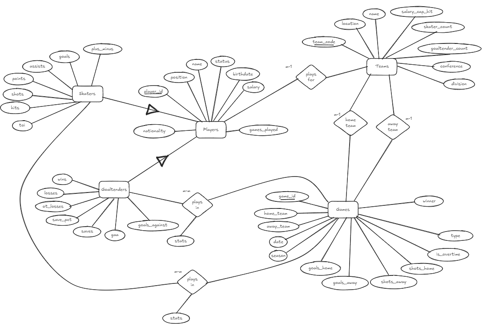

# 1. Application Domain Introduction:

**Purpose: Introduce the background information of your application, including but not limited to, the relevant domain knowledge used/assumed in your project and the target user(s) of your application.**

The domain I will be designing my database system project around is the National Hockey League (NHL). My plan is to make a player and team statistics database for my own hockey league (using NHL rules). Statisticians can use this system to create narratives or find trends (for certain players, time periods, or teams) in hockey. This database will also be used by league managers, who can put in game data that will automatically update other tables.
- Note: right now it is limited to the 'regular season' and not the playoffs, but playoff qualification (both current and historical) is stored.

## 1.1 Players:

A player has a unique ID and plays for 1 team in the league. They have a yearly salary (Ex. $7,500,500) that contributes towards a team's salary cap in the league, a nationality (Ex. Canada), a birth date, and a position that they play (Ex. RW for 'right wing'). Players on a team have different roles; there are forwards, defenders, and goaltenders. For the purpose of this project, forwards and defenders will be under a 'skaters' entity as they share the same statistics, but goaltenders have different statistics and will be treated differently. 

All players will have a status, 'Active', 'Retired', or 'Inactive'. Players that are injured will be given the 'Inactive' status. Only 'Active' players contribute toward a team's salary cap. Each player has a jersey number (1-99) as well.

A player can play games, where they can earn stats specific to their player type. There are two main types of players: skaters and goaltenders.

### 1.1.1 Skaters:

 Skaters can play games where they can score goals and get assists, both of which contribute to their points. They can also take shots on goal, hit other players, and will have a plus/minus score based on if they were on the ice when their team was scored vs. scored on. Their average time on ice (TOI) is also tracked, it is the amount of time the skater is actively on the ice and not on the bench in a game.
- Note: Modern hockey statistics use metrics like Corsi, Fenwick, etc. that is beyond the scope of this project.

### 1.1.2 Goaltenders:

A goaltender has a record for all the games they played, comprised of their wins, losses, and overtime losses. They can get saves by stopping shots on goal. They have a save% (ranging from 0.000 to 1.000), and a goals against average (gaa) (a goal against is a goal scored on them).

## 1.2 Teams and Team Statistics:

There are 32 teams in the league, each team has a location (city/state/province), and a name, which is combined with their location. Each team has a 3 letter code, typically based on their location. A team belongs to one of the four divisions in a league based on their geographical location. A team also is in one of the two conferences in the league based on the division they are in. 

A team must have between 20-23 players, with 2 goaltenders and 18-21 'skaters' (forwards or defenders). Each team has a salary cap that they must adhere to, this is cap is the same for all teams. The sum of all their players' salaries (called the salary cap hit) will be tracked and must be under this salary cap. 
- Note: Teams also have coaches, managers, etc. but that is out of the scope for this project.

**Note: This data will be stored in the standings table**
Each team plays 82 games in a season and has a record comprised of wins, losses, and overtime losses, they award the team 2 points, 0 points, and 1 point respectively. Teams will play 41 home games at their home arena and 41 away games away from their home arena, normally, both of their home and away records are stored, but for this project, that is out of scope. A team's goals for (total goal scored) and goals against (goals scored on them) are stored, along with their goal differential (goals for - goals against). 

## 1.3 Games:

A game is played by two teams, a home team and an away team. The game is played at the home team's venue. For this project, the home team will be marked and the location will be assumed. Each game will have a date (E.g. 03/07/2025) and will be played in a season (e.g. 2024-25). Games will have a unique game ID.
- Note: Games will have a type 'regular' for regular season games and 'playoff' for playoff games. Playoff game data will be a stretch feature as it is kept separate from all season data.

Each team has stats in a game that are tracked in the games table, such as shots on goal, goals scored, etc. Player-specific statistics will be kept in separate 'player-game records' tables (described in the business data description). After a game is played, both of the teams' stats are updated and therefore their records in the current standings are updated.

## 1.4 Standings:

All game table information for a season will be stored in the standings table. Each season is differentiated by the year it starts and ends (E.g. season 2024-25). There will be two standings tables, the '**current standings**', which displays exclusively the team records from the current ongoing season, and the '**historical standings**', which displays all of the team records from every past season. At the end of a season, all records from the 'current standings' will be dumped into the 'historical standings' table. This is to reduce the impact of errors in data entries, and adds an additional layer of data integrity as the data gets double checked before being stored into the historical table.

#### 1.4.1 Playoff Qualification (Part of Standings):

As explained above, the teams are put into divisions based on their geographical location. There are 2 conferences, western and eastern, each conference has 2 divisions. There are 4 divisions in the league, each division has 8 teams. At the end of the season, 16 teams get into the playoffs (8 per conference), a tournament to win the Stanley Cup.
- A team gets into the playoffs if they are top 3 in their division (by points).
- The final 2 teams in each conference get the 'wild card' spots. 
	- The wild card spots are determined by the two teams with the highest point totals outside of the 6 already qualified teams, regardless of division.
- An additional playoff status column will be **kept in the teams table** and displayed in the standings table as well:
	- Teams marked with an 'X' have qualified for the playoffs.
	- Teams with a 'Y' have gotten first in their division, but not their conference.
	- The team with a 'Z' has won their division and conference, but not the league.
	- The team with a 'P' has won the President's Trophy, meaning they have the most points of any team that year. 
	- Teams with a 'E' in this column have been eliminating from playoff contention.

## 1.5 Target Users:

There are two main types of users; **viewers and updaters.**

**Examples of viewers:**
- Sports analysts
- Team coaches and scouts
- Fantasy hockey players
- Journalists
- Fans
**Examples of updaters:**
- League hired statistics/database managers
- League managers/office members

# 2. Business Data Description: 

**Purpose: Describe any relationships among the data used in your application. This description should match with your database design of the next section**

## 2.1 Player plays for a team: 

Each player plays for one team, they can change teams, but that is beyond the scope of this project. Each team pays a player a salary, which contributes to that team's salary cap hit/usage.

## 2.2 Skaters and Goaltenders are generalized as players:

From 'Players' section above: 
"Players on a team have different roles; there are forwards, defenders, and goaltenders. For the purpose of this project, forwards and defenders will be under a 'skaters' entity as they share the same statistics, but goaltenders have different statistics and will be treated differently." 

This means that skaters and goaltenders will be generalized under a 'Players' entity.

## 2.3 Players play a game against a team:

Each game consists of two teams (one home and one away) playing against each other on a specific date. Put in different terms, **each player on one team plays games against other teams**. In my database, each individual player's statistics from a game will be stored in two (more on that below) '**player-game records**' tables, along with the team they played against. This is a many-to-many relationship between players and games.

Since skaters and goaltenders have different statistics, two player-game records tables will be made:
- The 'SkaterGames' table for skaters.
- The 'GoaltenderGames' table for goaltenders.

## 2.4 Teams and games:

Two teams play against each other in a game at any give point. One team is the 'home team', meaning the game is played at their arena, the other team is the 'away team'. Two teams can play each other multiple times, but never on the same date. A team can only play one game per date. This is two many-to-one relationships between teams and games.

# 3. Application (Business Logic) Requirements: 

**Goal: List and explain at least three to five substantially distinct functionalities that will be implemented in your project.**

**Goal: List and explain as many reasonable functionalities in your selected application domain as you like. It would be the best if all your listed functionalities logically belong to the same audience group.**

As described above, there are two different types of user groups; viewers and updaters.
My project will have two different applications/interfaces, one for each.

## 3.1 Viewers:

**Player & Team Performance Tracking**
- Users can search and filter players/teams based on performance metrics.
- Provides historical and season-to-date statistics.
- Displays leaderboards for goals, assists, points, save percentages, etc.
**Game Results & Matchup Analysis**
- Users can view past game results and upcoming matchups.
- Head-to-head team comparisons with win-loss history.
**Custom Queries & Reports**
- Allows users to generate custom reports (e.g., "Best home teams in the last 5 seasons").
- Reports on salary cap efficiency (e.g., cost per goal or cost per point).
- This can help users create narratives for players/teams or find out specific trends in the sport in different time periods.

## 3.2 Updaters:

**Automatic Updating:**
- League managers can input game data manually and have the current standings table automatically update based on the game data.
- League managers can input player-game data manually and have player data automatically update based on the player-game data.
- League managers can automatically designate playoff qualification statuses to teams at the end of the year based off of standings position.
- League managers can add a new player to the database and add them to a team (having team statistics automatically update).
**Playoff Matchups:**
- League managers can automatically generate a playoff bracket based off of current standings data.
**Database Maintenance:**
- League managers can dump all Games into a HistoricalGames table at the end of a season.
- League managers can dump Standings into a HistoricalStandings table at the end of a season.
**Change League-Wide Information:**
- League managers can change league-wide constraints like salary cap and current season.
**Note: Updaters will have permissions to all functionalities the viewers have access to.**

# 4. Database Design: 

**Goal: identify what kind of data should be collected and maintained in your selected application domain. The data should at least be sufficient to support the functionalities you intend to implement.**
- **Draw the ER diagram and translate it into the database schema. The database schema can be presented as SQL statements (create table statements).**

## 4.1 ER Diagram

Here is the ER diagram for my database. It represents the **current snapshot** of data within my system/application. UPDATE IT LATER

- On the skater/goaltender plays in games (many-to-many) relationship sets, the attribute 'stats' is representative of all of the player stats a player has for that particular game (goals, assists, points, shots for skaters and goals against, saves, save_pct for goaltenders)

### 4.1.1 Materialized Views and Historical Standings
Not all of the data my system captures is represented in the ER diagram, as there is a lot of calculated data (like standings) and historical data (like past games/standings) that will be frequently accessed by users.
- Note: I came to this conclusion after discussing the problem of including these in my ERD with you, as I learned that this data isn't meaningful as it isn't part of the current snapshot of data.

Since **standings** are made up purely off of calculated data from the games table, standings will be a **materialized** view. This view takes games data from the current season and some team information (such as team name and playoff qualification status). This view will refresh whenever the games table is updated (likely through a trigger).

Since I want to display current standings and games data separately from past seasons, historical records will be kept. Whenever a season ends, the league manager can run a script that dumps all of the data in the games table into a historical games table, and a script that dumps all the rows from the standings table into a historical standings table. 
- This way, users can query the historical statistics and results without destroying the performance of the program. As the games and standings tables get updated so frequently, having the standings table do a table wide filter and calculation on every game in history would be incredibly inefficient.
- While you could make the same argument for the skaters and goaltenders tables, those ones will pull information from every game in existence and may be expanded to have unique information in the future. Continuously updating the tables is more efficient and means that it can be joined with other tables easier.

## 4.2 Create Table Statements

Here are the create table statements for all of the tables in my database.
```sql
CREATE TABLE Teams (
    teamCode CHAR(3) PRIMARY KEY,
    location VARCHAR(20),
    name VARCHAR(20),
    salaryCapHit NUMBER,
    skaterCount NUMBER CHECK(skaterCount <= 21),
    goaltenderCount NUMBER CHECK(goaltenderCount <= 3),
    conference VARCHAR(10) CHECK(conference IN ('Western', 'Eastern')),
    division VARCHAR(15) CHECK(division IN ('Pacific', 'Central', 'Metropolitan', 'Atlantic')),
    playoffStatus CHAR(1)
);

CREATE TABLE Players (
    playerID NUMBER PRIMARY KEY,
    name VARCHAR(50),
    team CHAR(3),
    salary NUMBER,
    nationality VARCHAR(30) NOT NULL,
    birthdate DATE NOT NULL,
    position VARCHAR(2) CHECK(position IN ('C', 'RW', 'LW', 'D', 'G')),
    gamesPlayed NUMBER,
    status VARCHAR(10) DEFAULT 'Active' CHECK(status IN ('Active', 'Inactive', 'Retired')),
    jerseyNumber NUMBER CHECK(jerseyNumber >= 1 AND jerseyNumber <= 99),
    FOREIGN KEY (team) REFERENCES Teams(teamCode)
);

CREATE TABLE Skaters (
    playerID NUMBER PRIMARY KEY REFERENCES Players(playerID),
    goals NUMBER,
    assists NUMBER,
    points NUMBER,
    shots NUMBER,
    hits NUMBER,
    plusMinus NUMBER,
    TOI VARCHAR(6) DEFAULT '0:00'
);

CREATE TABLE Goaltenders (
    playerID NUMBER PRIMARY KEY REFERENCES Players(playerID),
    wins NUMBER,
    losses NUMBER,
    OTLosses NUMBER,
    savePct NUMBER(4, 3) DEFAULT 0.000 CHECK(savePct >= 0 and savePct <= 1),
    saves NUMBER,
    goalsAgainst NUMBER,
    GAA NUMBER(4, 2) DEFAULT 0.00
);

CREATE TABLE Games (
    gameID NUMBER PRIMARY KEY,
    homeTeam CHAR(3), 
    awayTeam CHAR(3),
    gameDate DATE,
    season VARCHAR(20),
    gameType VARCHAR(10) DEFAULT 'Regular' CHECK(gameType IN ('Regular', 'Playoff')),
    winner CHAR(3), 
    goalsHome NUMBER,
    goalsAway NUMBER,
    shotsHome NUMBER,
    shotsAway NUMBER,
    isOvertime CHAR(1) DEFAULT 'N' CHECK(isOvertime IN ('Y', 'N')),
    FOREIGN KEY (homeTeam) REFERENCES Teams(teamCode),
    FOREIGN KEY (awayTeam) REFERENCES Teams(teamCode),
    FOREIGN KEY (winner) REFERENCES Teams(teamCode)
);

CREATE TABLE SkaterGames (
    playerID NUMBER,
    gameID NUMBER,
    goals NUMBER,
    assists NUMBER,
    points NUMBER,
    shots NUMBER,
    hits NUMBER,
    plusMinus NUMBER,
    TOI VARCHAR(6) DEFAULT '0:00',
    FOREIGN KEY (playerID) REFERENCES Skaters(playerID),
    PRIMARY KEY (playerID, gameID)
);

CREATE TABLE GoaltenderGames (
    playerID NUMBER,
    gameID NUMBER,
    win NUMBER,
    loss NUMBER,
    OTLoss NUMBER,
    savePct NUMBER(4, 3) DEFAULT 0.000 CHECK(savePct >= 0 and savePct <= 1),
    saves NUMBER,
    goalsAgainst NUMBER,
    GAA NUMBER(4, 2) DEFAULT 0.00,
    FOREIGN KEY (playerID) REFERENCES Goaltenders(playerID),
    PRIMARY KEY (playerID, gameID)
);

CREATE TABLE Standings (
    season VARCHAR(20),
    teamCode CHAR(3),
    teamName VARCHAR(40),
    conference VARCHAR(10) CHECK(conference IN ('Western', 'Eastern')),
    division VARCHAR(15) CHECK(division IN ('Pacific', 'Central', 'Metropolitan', 'Atlantic')),
    gamesPlayed NUMBER,
    wins NUMBER,
    losses NUMBER,
    overtimeLosses NUMBER,
    points NUMBER,
    pointPct NUMBER(4, 3),
    goalsFor NUMBER,
    goalsAgainst NUMBER,
    goalDifferential NUMBER,
    playoffStatus CHAR(1) DEFAULT '-',
    PRIMARY KEY (season, teamCode),
    FOREIGN KEY (teamCode) REFERENCES Teams(teamCode)
);

CREATE TABLE HistoricalStandings (
    season VARCHAR(20),
    teamCode CHAR(3),
    teamName VARCHAR(40),
    conference VARCHAR(10) CHECK(conference IN ('Western', 'Eastern')),
    division VARCHAR(15) CHECK(division IN ('Pacific', 'Central', 'Metropolitan', 'Atlantic')),
    gamesPlayed NUMBER,
    wins NUMBER,
    losses NUMBER,
    overtimeLosses NUMBER,
    points NUMBER,
    pointPct NUMBER(4, 3),
    goalsFor NUMBER,
    goalsAgainst NUMBER,
    goalDifferential NUMBER,
    playoffStatus CHAR(1) DEFAULT '-',
    archiveDate DATE DEFAULT SYSDATE, -- To show when row was added to records.
    PRIMARY KEY (season, teamCode),
    FOREIGN KEY (teamCode) REFERENCES Teams(teamCode)
);

CREATE TABLE HistoricalGames (
    gameID NUMBER PRIMARY KEY,
    homeTeam CHAR(3), 
    awayTeam CHAR(3), 
    gameDate DATE,
    season VARCHAR(20),
    gameType VARCHAR(10) DEFAULT 'Regular' CHECK(gameType IN ('Regular', 'Playoff')),
    winner CHAR(3),
    goalsHome NUMBER,
    goalsAway NUMBER,
    shotsHome NUMBER,
    shotsAway NUMBER,
    isOvertime CHAR(1) DEFAULT 'N' CHECK(isOvertime IN ('Y', 'N')),
    archiveDate DATE DEFAULT SYSDATE, -- To show when row was added to records.
    FOREIGN KEY (homeTeam) REFERENCES Teams(teamCode),
    FOREIGN KEY (awayTeam) REFERENCES Teams(teamCode),
    FOREIGN KEY (winner) REFERENCES Teams(teamCode)
);
```

SkaterGames and GoaltenderGames tables don't have gameID has a foreign key because this causes problems when Games are dumped to HistoricalGames. This is a short term solution and if I had more time to design this database I would add historical tables for both skater and goaltender games.
- Instead, my application tries its best to enforce data integrity (it checks if the gameID is valid before doing updates).

### 4.2.1 Standings Materialized View
You may notice that standings isn't a materialized view, but a table instead. This is because I couldn't get it to work as a materialized view without errors and don't have enough time to troubleshoot. 

**To make up for this, I have made two new functionalities in my DB application:**
1. `generateStandings()` - Generates standings for the current season based on all current data in the Games table.
	- If no game records, will make a standings table with all teams and default values (as if beginning of a season).
2. `updateStandings()` - Updates standings for two teams based on the data from one record in the Games table.
Here are my best attempts at making it a materialized view:
**Attempt 1:**
```sql
CREATE MATERIALIZED VIEW Standings
BUILD IMMEDIATE
REFRESH ON COMMIT
AS
SELECT
    base.teamCode,
    base.teamName,
    base.conference,
    base.division,
    base.gamesPlayed,
    base.wins,
    base.losses,
    base.overtimeLosses,
    2 * base.wins + base.overtimeLosses AS points,
    2 * base.wins + base.overtimeLosses / (base.gamesPlayed * 2) AS pointPct,
    base.goalsForHome + base.goalsForAway AS goalsFor,
    base.goalsAgainstHome + base.goalsAgainstAway AS goalsAgainst,
    (base.goalsForHome + base.goalsForAway) - (base.goalsAgainstHome + base.goalsAgainstAway) AS goalDifferential,
    base.playoffStatus
    *
FROM (
    SELECT
        t.teamCode,
        t.location || ' ' || t.name AS teamName,
        t.conference,
        t.division,
        -- Games Played
        (SELECT COUNT(*) 
        FROM Games g 
        WHERE (g.homeTeam = t.teamCode OR g.awayTeam = t.teamCode)) AS gamesPlayed,
        -- Wins
        (SELECT COUNT(*) 
        FROM Games g 
        WHERE g.winner = t.teamCode) AS wins,
        -- Losses
        (SELECT COUNT(*) 
        FROM Games g 
        WHERE (g.homeTeam = t.teamCode OR g.awayTeam = t.teamCode)
        AND g.winner != t.teamCode
        AND g.winner IS NOT NULL
        AND g.isOvertime = 'N') AS losses,
        -- Overtime Losses
        (SELECT COUNT(*) 
        FROM Games g 
        WHERE (g.homeTeam = t.teamCode OR g.awayTeam = t.teamCode)
        AND g.winner != t.teamCode
        AND g.winner IS NOT NULL
        AND g.isOvertime = 'Y') AS overtimeLosses,
        -- Goals For
        (SELECT SUM(goalsHome)
        FROM Games g 
        WHERE (g.homeTeam = t.teamCode)) as goalsForHome,
        (SELECT SUM(goalsAway)
        FROM Games g 
        WHERE (g.awayTeam = t.teamCode)) as goalsForAway,
        -- Goals Against
        (SELECT SUM(goalsAway)
        FROM Games g 
        WHERE (g.homeTeam = t.teamCode)) AS goalsAgainstHome,
        (SELECT SUM(goalsHome)
        FROM Games g 
        WHERE (g.awayTeam = t.teamCode)) AS goalsAgainstAway,
        t.playoffStatus    
    FROM Teams t
    LEFT JOIN Games g 
        ON (t.teamCode = g.homeTeam OR t.teamCode = g.awayTeam)
        AND g.season = '2024-25'
        AND g.gameType = 'Regular'
    GROUP BY t.teamCode, t.location || ' ' || t.name, t.conference, t.division, t.playoffStatus
) base;
```
**Attempt 2 (with with statements):**
```sql

CREATE MATERIALIZED VIEW Standings
BUILD IMMEDIATE
REFRESH ON COMMIT
AS
-- Games Played
WITH gamesPlayed AS(SELECT COUNT(*) 
                FROM Games g left join Teams t
                    ON (t.teamCode = g.homeTeam OR t.teamCode = g.awayTeam)
                    AND g.season = '2024-25'
                    AND g.gameType = 'Regular'
                WHERE (g.homeTeam = t.teamCode OR g.awayTeam = t.teamCode)),
-- Wins
wins AS (SELECT COUNT(*) 
    FROM Games g left join Teams t
        ON (t.teamCode = g.homeTeam OR t.teamCode = g.awayTeam)
        AND g.season = '2024-25'
        AND g.gameType = 'Regular'
    WHERE g.winner = t.teamCode),
-- Losses
losses AS (SELECT COUNT(*) 
    FROM Games g left join Teams t
        ON (t.teamCode = g.homeTeam OR t.teamCode = g.awayTeam)
        AND g.season = '2024-25'
        AND g.gameType = 'Regular'
    WHERE (g.homeTeam = t.teamCode OR g.awayTeam = t.teamCode)
        AND g.winner != t.teamCode
        AND g.winner IS NOT NULL
        AND g.isOvertime = 'N'),
overtimeLosses AS (SELECT COUNT(*) 
    FROM Games g left join Teams t
        ON (t.teamCode = g.homeTeam OR t.teamCode = g.awayTeam)
        AND g.season = '2024-25'
        AND g.gameType = 'Regular'
    WHERE (g.homeTeam = t.teamCode OR g.awayTeam = t.teamCode)
    AND g.winner != t.teamCode
    AND g.winner IS NOT NULL
    AND g.isOvertime = 'Y'),
-- Goals For
goalsForHome AS (SELECT SUM(goalsHome)
    FROM Games g left join Teams t
        ON (t.teamCode = g.homeTeam OR t.teamCode = g.awayTeam)
        AND g.season = '2024-25'
        AND g.gameType = 'Regular'
    WHERE (g.homeTeam = t.teamCode)),
goalsForAway AS (SELECT SUM(goalsAway)
    FROM Games g left join Teams t
        ON (t.teamCode = g.homeTeam OR t.teamCode = g.awayTeam)
        AND g.season = '2024-25'
        AND g.gameType = 'Regular'
    WHERE (g.awayTeam = t.teamCode)),
-- Goals Against
goalsAgainstHome AS (SELECT SUM(goalsAway)
    FROM Games g left join Teams t
        ON (t.teamCode = g.homeTeam OR t.teamCode = g.awayTeam)
        AND g.season = '2024-25'
        AND g.gameType = 'Regular'
    WHERE (g.homeTeam = t.teamCode)),
goalsAgainstAway AS (SELECT SUM(goalsHome)
    FROM Games g left join Teams t
        ON (t.teamCode = g.homeTeam OR t.teamCode = g.awayTeam)
        AND g.season = '2024-25'
        AND g.gameType = 'Regular'
    WHERE (g.awayTeam = t.teamCode)),
SELECT
    t.teamCode,
    t.location || ' ' || t.name AS teamName,
    t.conference,
    t.division,
    gamesPlayed,
    wins,
    losses,
    overtimeLosses,
    2 * wins + overtimeLosses AS points,
    2 * wins + overtimeLosses / (gamesPlayed * 2) AS pointPct,
    goalsForHome + goalsForAway AS goalsFor,
    goalsAgainstHome + goalsAgainstAway AS goalsAgainst,
    (base.goalsForHome + base.goalsForAway) - (base.goalsAgainstHome + base.goalsAgainstAway) AS goalDifferential,
    -- goalsFor - goalsAgainst AS goalDifferential,
    t.playoffStatus
FROM Teams t
LEFT JOIN Games g 
    ON (t.teamCode = g.homeTeam OR t.teamCode = g.awayTeam)
    AND g.season = '2024-25'
    AND g.gameType = 'Regular'
GROUP BY t.teamCode, teamName, t.conference, t.division, t.playoffStatus;
```

# 5. Implementation Notes

**Goal: document which part of the application has been completed. Provide the sample data used to test the functionality that has been achieved and the test run results.**

### ***SEE THE `README.md` FOR INFORMATION ON THE FILE STRUCTURE OF THE APPLICATION.***

## 5.1 Achieved Functionality

As updaters had the more complex and useful functionalities, I prioritized their functionalities over the viewers.

Here are the functionalities I achieved from [section 3](#3-application-business-logic-requirements).

**Player & Team Performance Tracking**
- Provides historical and season-to-date statistics.
- Displays leaderboards for goals, assists, points, save percentages, etc.

**Automatic Updating:**
- League managers can input game data manually and have the current standings table automatically update based on the game data.
- League managers can input player-game data manually and have player data automatically update based on the player-game data.
- League managers can automatically designate playoff qualification statuses to teams at the end of the year based off of standings position.
- League managers can add a new player to the database and add them to a team (having team statistics automatically update).

**Database Maintenance:**
- League managers can dump all Games into a HistoricalGames table at the end of a season.
- League managers can dump Standings into a HistoricalStandings table at the end of a season.

**Change League-Wide Information:**
- League managers can change league-wide constraints like salary cap and current season.

Additionally, since my materialized view didn't work, a 'generate standings' functionality was achieved. It generates standings for the current season based on all current data in the Games table.

### 5.1.1 Unachieved Functionality

Here is what I didn't achieve within the timeframe.

**Player & Team Performance Tracking**
- Users can search and filter players/teams based on performance metrics.

**Game Results & Matchup Analysis**
- Users can view past game results and upcoming matchups.
- Head-to-head team comparisons with win-loss history.

**Custom Queries & Reports**
- Allows users to generate custom reports (e.g., "Best home teams in the last 5 seasons").
- Reports on salary cap efficiency (e.g., cost per goal or cost per point).
- This can help users create narratives for players/teams or find out specific trends in the sport in different time periods.

**Playoff Matchups:**
- League managers can automatically generate a playoff bracket based off of current standings data.

A lot of these are pretty quick additions, but with testing needed to be done, I dropped them. For example:
- Cost per stat is basically the same as stats leaderboards but I pull player's salary as well.
- Playoff matchups would be pretty easy as I have the algorithm for it in my `genPlayoffQual()` function.

## 5.2 Sample Data To Populate Database

All of the sample data I used was AI generated with small tweaks by myself.

The sample data used to populate my database when initialized is located within the `filldata` directory. These scripts contain hundreds of records.

To set up my database, I recommend going into sqlplus and pasting the following lines:
```sql
@filldata/createtables.sql 
@filldata/teamplayerdata.sql 
@filldata/gamedata.sql 

-- createtables.sql drops and creates all tables in the database.
-- teamplayerdata inserts 32 teams and hundreds of player, skater, and goaltender tuples.
-- gamedata inserts hundreds of game records.
```

## 5.3 Known Issues

- In `add_player` there aren't extensive checks for nationality and birthdate inputs.
- Salary cap and season variables reset each time the program is ran.
- TOI doesn't get updated when a new SkaterGame record is added with `add_skatergame`.
- No historical skater games or goaltender games tables so gameID has no foreign key constraint on those tables when it should.
- Probably more bugs if you really try to break the program which I am not aware of.

# 6. Testing Summary: 

**Describe the sample data used to populate your databased used in the application, and test run your application with different scenarios and present the results (and database changes) generated by your application.**

## 6.1 Testing Sample Data

The data in the `filldata` directory is used to do quite a few tests. However, this data does not cover all of the tests.

Additional sample data used to test certain functions is located within the `testdata` directory. These scripts are much smaller.

## 6.2 Test Runs and Results

To view my tests, I have made an [Appendix: 370 Testing](./testing.pdf) as the test documentation is long and has a lot of embedded images.

Tests are sorted by command, tests are run on all commands as this covers every function I have implemented.

# 7. Conclusion and Future Work

This was a very fun project and I enjoyed the challenge that I didn't expect when making my proposal. I wanted to do something I liked and hopefully unique enough to stand out, and I think I succeeded in that. However, when I initially proposed the idea of making a hockey database system, I didn't realize how complicated they were.

Here were some struggles I had:
- To have any meaningful data for an entire league, you need thousands of records of accurate data. 
- The materialized view stuff on complicated tables like Standings
- Almost all of the designing and figuring out what tables were required and not required in order to not have to do too much work but have decent database design where each table represents an individual fact.
- A lot of bugs (I hate Oracle documentation).
- The nature of hockey having a change to one stat affecting dozens of other stats.

Considering I had a lot of other work in other group projects, I am extremely impressed with the implementation I achieved in only a few days. This was an extremely valuable project where I learned a lot and had fun working on it for 8 hour sessions (seriously).

As for future work, my database application is pretty clunky and adding more to it would require a lot of additional work, so I'm not sure if I will do more stuff off of this project, but more use it as a tool/model to help me create more database systems in the future.

If I had to do more stuff on this project, I would try to fix all the known issues, finish the rest of the functionalities, and provide a lot more viewer functionalities.